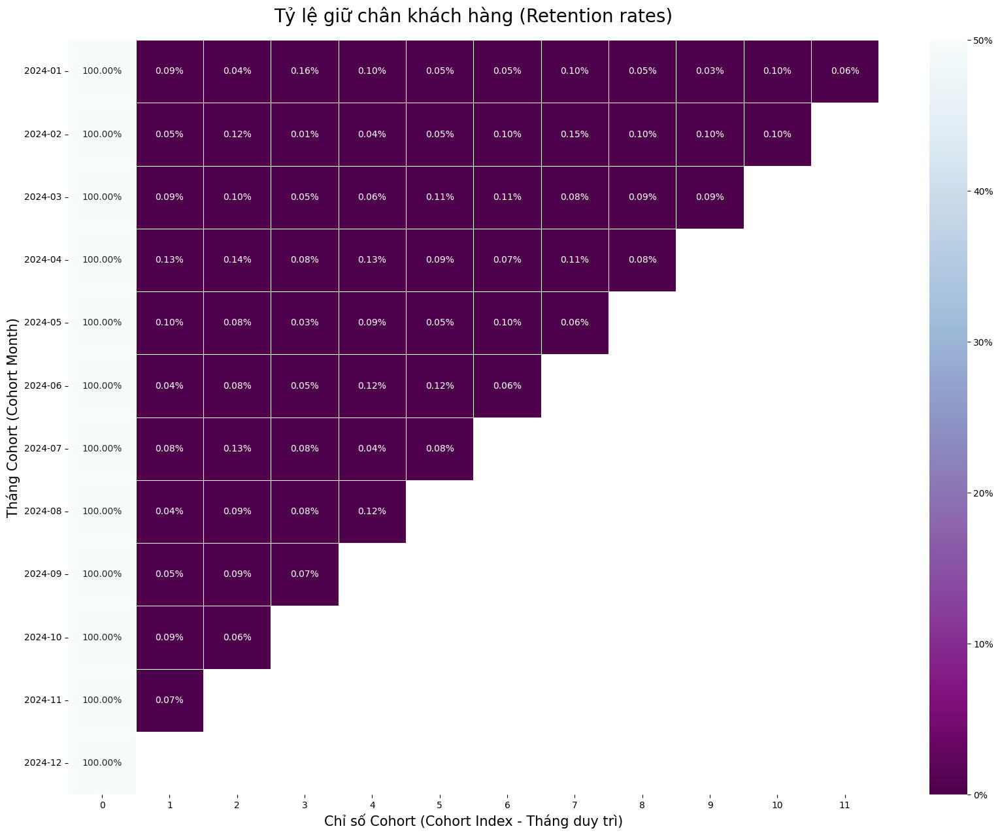

🚗 Uber Ride-Hailing: Operation Performance & Customer Behavior Analysis 🚀
📌 Tổng quan dự án (Overview)
Dự án tập trung phân tích hiệu suất vận hành và hành vi của hơn 148,800 khách hàng sử dụng dịch vụ gọi xe (NCR Ride Bookings) trong năm 2024. Mục tiêu cốt lõi là giải mã nghịch lý: Doanh thu tăng trưởng nhưng tỷ lệ giữ chân khách hàng (Retention) lại sụt giảm nghiêm trọng, từ đó đề xuất các giải pháp "cấp cứu" cho doanh nghiệp.

🏗️ Cấu trúc dự án theo mô hình S.T.A.R
1. Situation (Bối cảnh)
Dữ liệu: Tập dữ liệu chi tiết về 148,800 chuyến xe năm 2024, bao gồm thông tin đặt xe, trạng thái chuyến đi, doanh thu và đánh giá khách hàng.

Vấn đề: * Tỷ lệ hoàn thành chuyến (Completion Rate) thấp đáng báo động, chỉ đạt 68.56%.

Tỷ lệ giữ chân khách hàng (Retention) gần như bằng 0 ngay sau tháng đầu tiên (M1).

Doanh nghiệp đang lãng phí ngân sách Marketing cho các khách hàng "One-and-Done" (chỉ đi một lần rồi bỏ).

2. Task (Nhiệm vụ)
Phân khúc: Sử dụng mô hình RFM (Recency, Frequency, Monetary) để xác định các nhóm khách hàng giá trị.

Phân tích Retention: Xây dựng ma trận Cohort Analysis để tìm ra "điểm gãy" trong trải nghiệm người dùng.

Tối ưu vận hành: Xác định nguyên nhân gốc rễ dẫn đến việc hủy chuyến (Cancellations) để cải thiện tỷ lệ hoàn thành.

3. Action (Hành động)
Data Integration & Cleaning: Sử dụng Python (Pandas) để xử lý tập dữ liệu thô, chuẩn hóa định dạng thời gian và xử lý các giá trị nhiễu.

Feature Engineering: * Tính toán bộ chỉ số RFM cho hơn 100k khách hàng.

Xây dựng logic phân nhóm khách hàng dựa trên điểm số RFM.

Retention Modeling: Thiết lập ma trận Cohort theo tháng để theo dõi tỷ lệ quay lại của khách hàng theo từng loại xe.

Visualization: Thiết kế Dashboard Power BI để trực quan hóa các "điểm nóng" về vận hành và xu hướng sụt giảm retention.

4. Result (Kết quả)
Phân cụm: Định danh thành công 4 nhóm chiến lược: Champions, Potential Loyalists, Mainstream và At Risk.

Insight vận hành: Phát hiện 38% chuyến đi thất bại do lỗi hệ thống (App lỗi, giá ẩn) chứ không phải do tài xế.

Insight khách hàng: Nhóm Potential Loyalists có điểm tương đồng (Similarity Score) đạt 0.6455, cho thấy tiềm năng bán chéo (Cross-sell) cực lớn.

Chiến lược: Đề xuất 3 giải pháp trọng tâm: Chiến dịch "The Second Ride", khảo sát "Death-Point" và gói ưu đãi phí vận chuyển vùng lõi.

🛠️ Công nghệ sử dụng (Tech Stack)
Ngôn ngữ: Python (Pandas, NumPy, Matplotlib, Seaborn).

Phân tích dữ liệu: RFM Analysis, Cohort Analysis.

Công cụ trực quan hóa: Power BI, Microsoft Excel.

Môi trường: Jupyter Notebook, VS Code.

📊 Kết quả Demo
